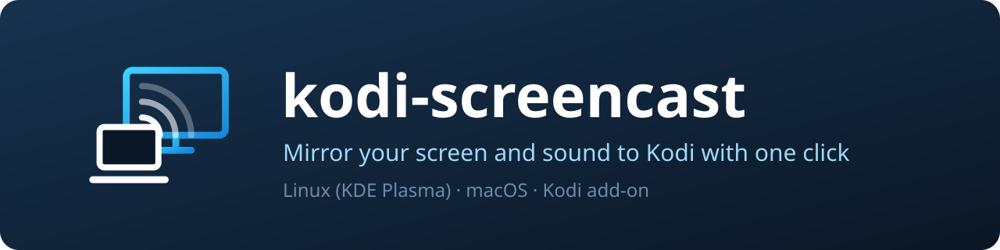

# kodi-screencast

Mirrors the screen and system sound of a Linux PC or a Mac to Kodi, with one
click or one command. Kodi keeps running as usual and shows the screen like a
video.

The interface of the Plasma widget and the Mac app is currently German only;
the labels below are quoted as they appear on screen.

## What you need

The project has two parts, which must be on the same network:

| Part | Where | Status |
|---|---|---|
| Add-on `plugin.video.screencast` | on Kodi | tested with LibreELEC 12.2.1 on a Pi 5 |
| Sender for Linux | KDE Plasma 6 on Wayland | tested on Arch with Intel graphics |
| Sender for macOS | macOS 14 or later | builds, not yet tried on a real Mac |

The add-on is always required, plus one of the two senders.

The sender sends the picture to UDP port 5004 and the sound to UDP port 5005
on Kodi, and controls Kodi through its HTTP interface (port 8080). A firewall
in between has to let that through.

## Installing the add-on on Kodi

Set up once in Kodi:

- Install the add-on `inputstream.ffmpegdirect`
- Settings > Services > Control: allow remote control via HTTP
- Settings > Services > General: enable Zeroconf (only needed for the Linux
  sender's automatic discovery)

Then copy the add-on, shown here for LibreELEC:

    scp -r plugin.video.screencast root@<KODI_IP>:/storage/.kodi/addons/
    ssh root@<KODI_IP> 'kodi-send --action="UpdateLocalAddons"'

Afterwards enable the add-on once in Kodi under Add-ons > My add-ons > Video
add-ons. After an update, disable and re-enable it there (or restart Kodi) so
the sound service reloads.

On other Kodi systems the add-on folder is in a different place. Sound needs
`python3` and `aplay` (ALSA) there; this has only been tried with LibreELEC.

## Linux

### Install

Packages (Arch):

    sudo pacman -S gst-plugin-pipewire gst-plugin-va gst-plugins-bad gst-plugins-good python-gobject avahi python-pipx

The sender encodes HEVC through VA-API; the graphics card has to support
that. Then, from the project folder:

    pipx install --system-site-packages -e .

### Plasma widget

    kpackagetool6 -t Plasma/Applet -i plasmoid     # to update: -u instead of -i

Add "Kodi-Screencast" as a widget to the panel. Its settings hold Kodi's IP
address (empty = search the network) and, if Kodi asks for a login, user name
and password. One click on the icon starts mirroring, another one stops it.
If starting fails, the tooltip shows the sender's error message.

### Command line

    kodi-screencast start --host <KODI_IP>
    kodi-screencast stop
    kodi-screencast status

Without `--host` the sender searches the network for Kodi. If Kodi asks for a
login, pass the credentials through `KODI_USER` and `KODI_PASSWORD` or
`--user`/`--password`. `start --help` lists all options (bitrate, picture
height, no sound, ports).

On first start KDE asks which screen to share. The choice is remembered.

## macOS

The menu bar app under `mac/` captures picture and system sound through macOS
itself and needs no other software.

### Download

GitHub builds the app on every change. Open the latest run under
[Actions > Mac-App](https://github.com/willheisenberg/kodi-screencast/actions/workflows/mac.yml)
and download the `KodiScreencast` package under "Artifacts" at the bottom
(you need to be signed in to GitHub). It contains `KodiScreencast.zip`; the
file `selftest.ts` is not needed.

Unpack `KodiScreencast.zip` on the Mac only. If it is unpacked on Linux or
Windows and the folder is copied over, the executable permission and the
signature can get lost, and the app will not start.

### Set up

1. Double-click `KodiScreencast.zip` to unpack it and drag the app into the
   Applications folder.
2. Open the app. It is not signed by Apple, so macOS blocks it at first:
   choose "Open Anyway" under System Settings > Privacy & Security.
3. A TV icon appears in the menu bar at the top right; the app does not show
   up in the Dock. Open "Einstellungen …" (settings) from the icon and enter
   Kodi's IP address, plus user name and password if Kodi asks for a login.
   There is no automatic network search here.
4. Choose "Übertragung starten" (start mirroring) and allow the prompts for
   screen recording and local network access. After granting screen
   recording, quit the app once and open it again.

After restarting the Mac, the icon is only back once the app is running. The
switch "Beim Anmelden starten" (launch at login) in the settings takes care
of that; if macOS does not accept it, add the app by hand under System
Settings > General > Login Items.

### Build it yourself

    cd mac && ./build-app.sh        # on a Mac with Xcode

The result is `mac/build/KodiScreencast.zip`.

## Good to know

- **Short freeze after starting:** The picture stands still once for about
  two seconds. This clears the backlog Kodi builds up while starting;
  afterwards the picture responds quickly.
- **Sound does not match the picture:** If the sound comes too early, raise
  the sound delay; if it comes too late, lower it. On Linux with
  `--audio-delay` (in ms, default 350), on the Mac in the settings.
- **Volume:** Kodi's volume has no effect on the mirrored sound, the TV's
  volume does. While mirroring, Kodi itself plays no sound.
- **No sound:** Disable and re-enable the add-on in Kodi; the sound service
  only starts together with the add-on.
- **"Kodi verlangt Benutzername und Passwort"** (Kodi asks for user name and
  password): enter the credentials from Kodi's settings under Services >
  Control.
- **Delay:** About 0.3 s for the picture, calculated from Kodi's debug log;
  not yet measured with a stopwatch at the TV.

## For developers

    python3 -m pytest               # sender and add-on
    cd mac && swift test            # Mac app, macOS only

Structure and background, including why the sound bypasses Kodi's player, are
in the [design document](docs/superpowers/specs/2026-10-09-kodi-screencast-design.md)
(in German).
